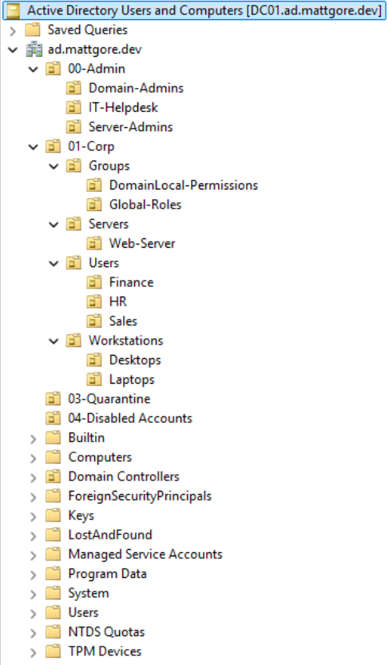

# Active Directory & Microsoft Entra ID Integration

## Project Overview
This project implements a hybrid identity infrastructure that bridges on-premises Active Directory with Microsoft Entra ID. The on-premises AD environment was deployed on a Proxmox Virtual Environment hypervisor on a bare-metal HP EliteDesk Mini PC. Using the Microsoft Entra Cloud Sync provisioning agent, non-administrative users were synchronized to the cloud while administrative accounts were excluded from cloud exposure to prevent privilege escalation by threat actors. The AD environment includes endpoint security hardening and shared drive mapping using Group Policy Objects. The Entra tenant was integrated with Microsoft 365 services, incorporating configured SharePoint sites, Exchange Online shared mailboxes, and mail flow transport rules.

## IP Address Schema

| Device / VM | Bridge | IP Address | Subnet Mask | Gateway | DNS Configuration | Role |
| :--- | :--- | :--- | :--- | :--- | :--- | :--- |
| **Home Router** | — | `192.168.86.1` | `255.255.255.0` | — | ISP | Default Gateway & DHCP |
| **Proxmox Host** | `vmbr0` | `192.168.86.10` | `255.255.255.0` | `192.168.86.1` | `192.168.86.1` | Hypervisor Management |
| **DC01** | `vmbr0` | `192.168.86.11` | `255.255.255.0` | `192.168.86.1` | `127.0.0.1` | Domain Controller / AD DNS |
| **IIS01** | `vmbr0` | `192.168.86.13` | `255.255.255.0` | `192.168.86.1` | `192.168.86.11` | IIS Web Server |
| **WIN11-01** | `vmbr0` | `192.168.86.12` | `255.255.255.0` | `192.168.86.1` | `192.168.86.11` | Test Client Endpoint |

## AD Domain Services & DNS Setup

**Root Domain FQDN:** ad.mattgore.dev

**NetBIOS Name:** AD

**Forest Functional Level:** Windows Server 2025

**DNS Routing:** Integrated AD DNS configured with the upstream forwarder (1.1.1.1) to handle non-authoritative resolution while keeping local SRV records authoritative. Reverse Lookup Zone configured (86.168.192.in-addr.arpa) to support IP-to-hostname resolution and network diagnostics using the nslookup command.

**Alternative UPN Suffix:** mattgore.dev

## OU Architecture

  

## AGDLP Group Design
To simplify management of my Active Directory environment and to prepare for future multi-domain and multi-forest home lab additions, I decided to utilize the AGDLP framework. 

**A - Account:** Individual user accounts reside in OU=Users,OU=01-Corp. User accounts are never granted direct access to files, folders, or servers.

**G - Global Group:** Global Groups reside in OU=Global-Roles,OU=Groups,OU=01-Corp. User accounts are placed into Global Security Groups based on their job role in the organization.

**DL - Domain Local Groups:** Domain Local Groups exist in OU=DomainLocal-Permissions,OU=Groups,OU=01-Corp. A Domain Local Security Group is created to represent a specific resource.

**P - Permissions:** The actual rights on a resource (Read, Write, Execute, etc.) are assigned only to the Domain Local Groups.

<h2>Languages and Utilities Used</h2>

- <b>PowerShell</b> 
- <b>VirtualBox</b>

<h2>Environments Used </h2>
- <b>Windows Server 2022</b>
- <b>Windows 10</b> 
