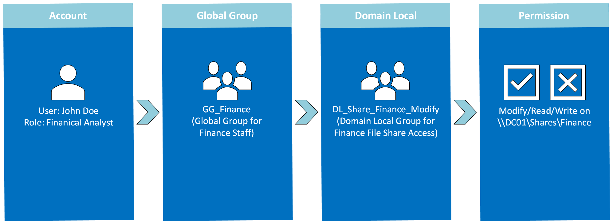
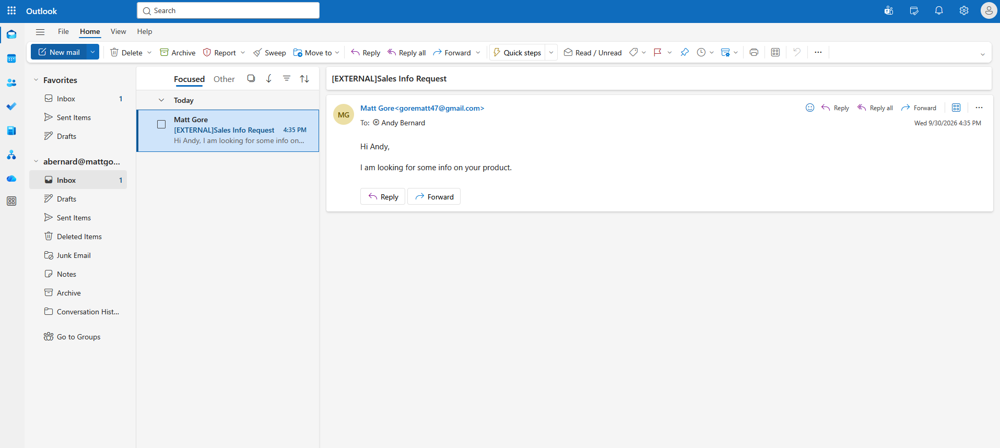
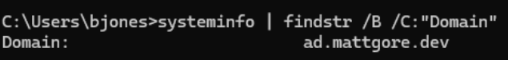
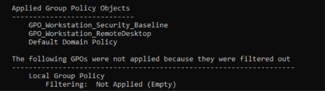
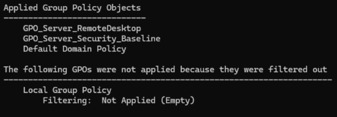

# Active Directory & Microsoft Entra ID Integration

## Project Overview
This project implements a hybrid identity infrastructure that bridges on-premises Active Directory with Microsoft Entra ID. The on-premises AD environment was deployed on a Proxmox Virtual Environment hypervisor on a bare-metal HP EliteDesk Mini PC. Using the Microsoft Entra Cloud Sync provisioning agent, non-administrative users were synchronized to the cloud while administrative accounts were excluded from cloud exposure to prevent privilege escalation by threat actors. The AD environment includes endpoint security hardening and shared drive mapping using Group Policy Objects. The Entra tenant was integrated with Microsoft 365 services, incorporating configured SharePoint sites, Exchange Online shared mailboxes, and mail flow transport rules.

## IP Address Schema

| Device / VM | Bridge | IP Address | Subnet Mask | Gateway | DNS Configuration | Role |
| :--- | :--- | :--- | :--- | :--- | :--- | :--- |
| **Home Router** | — | `192.168.86.1` | `255.255.255.0` | — | ISP | Default Gateway & DHCP |
| **Proxmox Host** | `vmbr0` | `192.168.86.10` | `255.255.255.0` | `192.168.86.1` | `192.168.86.1` | Hypervisor Management |
| **DC01** | `vmbr0` | `192.168.86.11` | `255.255.255.0` | `192.168.86.1` | `127.0.0.1` | Domain Controller / AD DNS |
| **IIS01** | `vmbr0` | `192.168.86.13` | `255.255.255.0` | `192.168.86.1` | `192.168.86.11` | IIS Web Server |
| **WIN11-01** | `vmbr0` | `192.168.86.12` | `255.255.255.0` | `192.168.86.1` | `192.168.86.11` | Test Client Endpoint |

## AD Domain Services & DNS Setup

**Root Domain FQDN:** ad.mattgore.dev

**NetBIOS Name:** AD

**Forest Functional Level:** Windows Server 2025

**DNS Routing:** Integrated AD DNS configured with the upstream forwarder (1.1.1.1) to handle non-authoritative resolution while keeping local SRV records authoritative. Reverse Lookup Zone configured (86.168.192.in-addr.arpa) to support IP-to-hostname resolution and network diagnostics using the nslookup command.

**Alternative UPN Suffix:** mattgore.dev

## OU Architecture

  

## AGDLP Group Design
To simplify management of my Active Directory environment and to prepare for future multi-domain and multi-forest home lab additions, I decided to utilize the AGDLP framework. 

**A - Account:** Individual user accounts reside in OU=Users,OU=01-Corp. User accounts are never granted direct access to files, folders, or servers.

**G - Global Group:** Global Groups reside in OU=Global-Roles,OU=Groups,OU=01-Corp. User accounts are placed into Global Security Groups based on their job role in the organization.

**DL - Domain Local Groups:** Domain Local Groups exist in OU=DomainLocal-Permissions,OU=Groups,OU=01-Corp. A Domain Local Security Group is created to represent a specific resource.

**P - Permissions:** The actual rights on a resource (Read, Write, Execute, etc.) are assigned only to the Domain Local Groups.

  

## Group Policy Implementation

### GPO_User_DriveMappings

**GPO Link:** OU=Users,OU=01-Corp

**GPO Objective:** Attach persistent network share drives when users log in, eliminating manual setup.

**Policy Configurations:** 

User Configuration > Preferences > Windows Settings > Drive Maps > New > Mapped Drive

### GPO_Workstation_Security_Baseline

**GPO Link:** OU=Workstations,OU=01-Corp

**GPO Objective:** Prevent unauthorized physical session takeover if users step away from their computer. Ensure attackers cannot intercept credentials by exploiting Link-Local Multicast Name Resolution queries. Block lateral movement from internal clients and protect workstations from attacks beyond the corporate perimeter.

**Policy Configurations:** 

Computer Configuration > Policies > Windows Settings > Security Settings > Local Policies > Security Options > Machine inactivity limit > 900 seconds

Computer Configuration > Policies > Administrative Templates > Network > DNS Client > Turn off multicast name resolution (Enabled)

Computer Configuration > Policies > Windows Settings > Security Settings > Windows Defender Firewall with Advanced Security > Firewall state (On)

### GPO_Workstation_RemoteDesktop

**GPO Link:** OU=Workstations,OU=01-Corp

**GPO Objective:** Provide the IT helpdesk with the ability to initiate a remote connection to client workstations.

**Policy Configurations:**

Computer Configuration > Policies > Administrative Templates > Windows Components > Remote Desktop Services > Remote Desktop Session Host > Connections > Allow users to connect remotely by using Remote Desktop Services (Enabled)

Computer Configuration > Policies > Administrative Templates > Windows Components > Remote Desktop Services > Remote Desktop Session Host > Connections > Security > Require user authentication for remote connections by using network level authentication (Enabled)

Computer Configuration > Policies > Windows Settings > Security Settings > Windows Defender Firewall with Advanced Security > Inbound Rules > New Rule > Predefined: Remote Desktop

### GPO_Server_Security_Baseline

**GPO Link:** OU=Servers,OU=01-Corp

**GPO Objective:** Block unauthenticated connections from querying the Security Account Manager (SAM) to extract account names and network shares. Log events whenever a server validates submitted credentials to improve auditability of attacks.

**Policy Configurations:**

Computer Configuration > Policies > Windows Settings > Security Settings > Advanced Audit Policy Configuration > System Audit Policies > Account Logon > Audit Credential Validation > Success & Failure

Computer Configuration -> Policies > Windows Settings > Security Settings > Local Policies > Security Options > Network access > Do not allow anonymous enumeration of SAM accounts and shares (Enabled)

## Entra ID Integration & Configuration

**Entra License Tier:** Microsoft Entra ID Free

**Sync Utility:** Microsoft Entra Cloud Sync Agent

**Sync Scope:** OU=01-Corp,DC=ad,DC=mattgore,DC=dev

**Excluded OUs:** 00-Admin, 02-Service Accounts, 03-Quarantine, 04-Disabled Accounts

**Authentication Type:** Password Hash Synchronization (PHS)

## Microsoft 365 Configuration

* **365 Licensing:** Chose 3 users from each department (HR, Sales, Finance) and assigned them the Business Basic Microsoft 365 License.

* **Exchange Online Administration:** Provisioned departmental shared mailboxes (HR, Sales, Finance) in Microsoft 365, enforcing least-privilege delegation by granting Send As rights strictly to a department lead and Read and Manage rights to team members.
  * A transport rule was implemented for all incoming external email to prepend "[External]" to the subject line, helping mitigate social engineering and phishing risks.

  

* **SharePoint Online Administration:** Deployed departmental Team Sites (HR, Sales, Finance) with isolated access permissions so only department members could access the information stored on the site. One departmental lead is given ownership permissions on the site.

## Testing

### Domain Join Confirmation
Using the dsregcmd /status command, I validated Windows 11 endpoint domain join to ad.mattgore.dev and confirmed successful interactive logon under the provisioned domain user profile bjones.

  

### GPO Application Validation
Using the gpresult diagnostic tool with the /scope computer switch evaluates the machine configuration context, verifying device-level GPO’s regardless of which user is logged in. 

Running the command on the Windows 11 endpoint, I was able to validate that the workstation-specific GPOs were successfully applied.

  

Running the command on the IIS Server, I was able to validate that the server-specific GPOs were successfully applied.

  

### Cloud Sync & Identity Verification
1. Created a new on-prem AD user, jmiller, in OU=Sales,OU=Users,OU=01-Corp.

2. Initiated a Cloud Sync cycle for this new user using the Provision on Demand feature in the Microsoft Entra admin center.

  

3. Successfully signed in to https://myaccount.microsoft.com using mmiller@mattgore.dev with the local AD password, which verifies that Password Hash Synchronization is operational.

